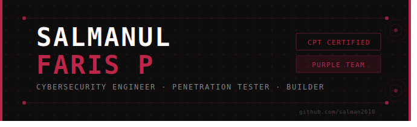

# Salmanul Faris P
### 🔴 Cybersecurity Engineer · Penetration Tester · Builder

*"Breaking things professionally. Building things obsessively."*

---

## 🧠 About Me

Cybersecurity Engineer at **Sesame Technologies** — I spend my days breaking web apps, APIs, and Android applications looking for vulnerabilities before the bad guys do. At night I build tools that monitor, detect, and defend.

M.Sc. Physics background → turns out thinking like a physicist (first principles, structured methodology, hypothesis testing) makes for a pretty good penetration tester.

- 🔴 **Offensive**: Web VAPT · API Security · Android App Testing · OWASP Top 10
- 🟣 **Defensive**: Purple Team · Server Monitoring · Log Analysis · File Integrity
- 🐍 **Building**: Python automation · FastAPI · React · PostgreSQL

---

## 🛠️ Tech Stack

### Offensive Security

### Languages

### Stack & Tools

---

## 🏆 Certifications

---

## 🚀 Featured Projects

### 🟣 [Purple Agent](https://github.com/salman2610/purple-agent) — AI SRE Monitoring Agent
> *"It's like having a junior sysadmin that never sleeps."*

AI-powered server monitoring agent that doesn't just show graphs — it tells you what's wrong and why.

- Real-time CPU, memory, disk, process and network monitoring
- AI-powered anomaly detection and plain-English diagnostics
- File integrity monitoring on critical directories
- JWT-authenticated agent deployable as `systemd` service

---

### 🔴 [CyberDefense Hub](https://github.com/salman2610/OWASP-Framework) — OWASP Automation Framework
> Modular automated vulnerability scanning aligned with OWASP Top 10.

- Integrates Nmap, Nikto, Nuclei, and API fuzzing in one pipeline
- OWASP Top 10 mapping with automatic severity classification
- Automated HTML report generation for audits and compliance

---

## 📊 GitHub Stats

---

## 🎯 What I'm Working On

- 🔴 Breaking web apps at Sesame Technologies by day
- 🟣 Building **Purple Agent** into a full SaaS product
- 📖 Grinding toward OSCP
- 🌐 Writing about Purple Team techniques

---

*Open to bug bounty collaborations, security research, and interesting problems.*

